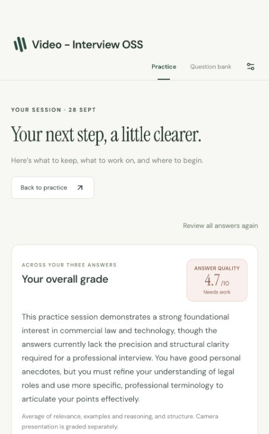
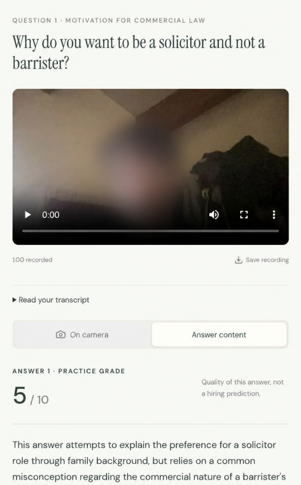
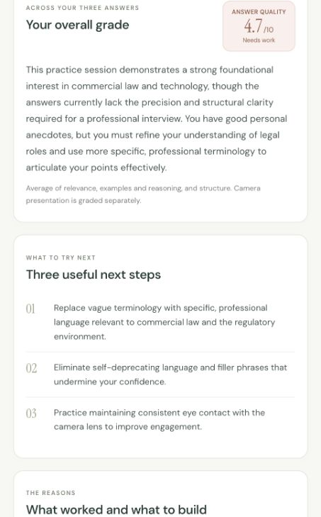
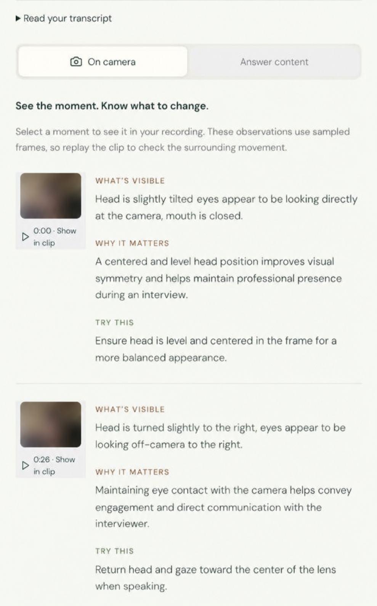

# Video Interview OSS

**Practise your answers. Replay the evidence. Improve the next attempt.**

An open-source, locally run video interview practice app for aspiring solicitors preparing for training contracts and vacation schemes. Record a three-question session, get transcript-based coaching and camera observations, and jump from feedback to the moment it refers to.

No account or hosted recording library. Bring your own OpenRouter key for AI feedback.

[Quick start](#quick-start) · [AI agent onboarding](#set-it-up-with-your-ai-agent) · [Architecture](architecture.md) · [Privacy](#your-recordings-and-your-key)

## A look inside

<table>
  <tr>
    <td width="50%"></td>
    <td width="50%"></td>
  </tr>
  <tr><td>Your next step, a little clearer.</td><td>Replay an answer and understand its feedback.</td></tr>
  <tr>
    <td></td>
    <td></td>
  </tr>
  <tr><td>Choose what to practise next.</td><td>See what to adjust on camera.</td></tr>
</table>

These show an actual saved practice session. The face in the replay screenshot and the camera thumbnails have been heavily blurred for privacy; those two images were edited and upscaled. Scores and feedback illustrate the interface, not a validated assessment of interview readiness. No original recording or unblurred camera image is included.

More product views: [feedback and replay evidence](docs/screenshots/feedback-evidence.jpg) · [session reasoning](docs/screenshots/session-reasoning-evidence.jpg) · [home](docs/screenshots/home.jpg) · [question bank](docs/screenshots/question-bank.jpg) · [settings](docs/screenshots/settings.jpg).

## What it does

- **Three questions per session:** one about motivation, one about experience, and one personal prompt.
- **Time to think:** read at your own pace, then start a five-second countdown and record for up to 60 seconds.
- **Feedback after the session:** review relevance, examples, reasoning, structure, and supported camera observations.
- **Evidence you can replay:** feedback points to actual transcript segments or sampled camera frames.
- **Local speech transcription:** faster-whisper runs on your computer through Python and ffmpeg.
- **Save and retry:** keep the latest session in the browser, download answers, and retry failed analysis without re-recording.
- **A searchable question library:** 200 numbered TCLA questions plus an additional unnumbered prompt, shown as 201 entries.

This is a working local prototype. Feedback is practice coaching, not an official marking scheme or a prediction of hiring success. Camera feedback uses still images; it does not analyse continuous video or vocal tone.

## Quick start

You need **Node.js 24**, **Python 3.10+**, **ffmpeg**, and a browser with camera/microphone and MediaRecorder support. The instructions below use a macOS/Linux shell. Windows users need equivalent Python environment and executable paths; Windows setup has not been validated here.

```bash
git clone https://github.com/vdfrz/Video-Interview-OSS.git
cd Video-Interview-OSS

# If you use nvm:
nvm use
npm ci

python3 -m venv .venv
.venv/bin/python -m pip install -r requirements.txt

# Install ffmpeg with your package manager if needed.
# macOS / Homebrew: brew install ffmpeg
# Ubuntu / Debian: sudo apt install ffmpeg

export TRANSCRIBE_PYTHON="$PWD/.venv/bin/python"
npm run dev
```

Open **[http://127.0.0.1:4310](http://127.0.0.1:4310)**. The local API runs on port 4311. The first transcription may download Whisper's base model weights.

1. Open Settings and enter your own OpenRouter API key when you want AI feedback. Enter it in the app, not in a chat, source file, or terminal command.
2. Start practice, allow the camera and microphone, and check the preview.
3. Record all three answers. AI feedback appears after the third answer when a key is present; you can also request it afterward.
4. Replay the evidence, choose one improvement, and try another session.

You can browse questions and record/replay without an API key. AI analysis requires an internet connection, an eligible OpenRouter route, and credits on your key. Configured models are `google/gemini-3.1-flash-lite` for content/session feedback and `qwen/qwen3-vl-32b-instruct` for camera stills. Availability and cost depend on the provider.

### Commands

| Command | Purpose |
|---|---|
| `npm run dev` | Start the Vite frontend and local Express API. |
| `npm test` | Run frontend and backend tests with controlled provider responses. |
| `npm run build` | Check TypeScript and build the frontend. |
| `npm start` | Serve the built app and API at `http://127.0.0.1:4311`. |
| `npm run check:publish` | Scan the Git index for private paths, unapproved binaries/media, and common secret formats. |

Stop the development API before `npm start`; both use port 4311. Production mode here means a local compiled app, not a public multi-user service.

The app reads configuration from the launching shell; it does **not** automatically load `.env`. Set `FFMPEG_PATH` if ffmpeg is not on `PATH`. See [architecture.md](architecture.md) for configuration, request limits, and failure handling.

## Set it up with your AI agent

Copy this into your coding agent:

```text
Set up https://github.com/vdfrz/Video-Interview-OSS locally for me.
Clone it if needed, then read README.md, architecture.md, AGENTS.md,
and docs/AI_AGENT_ONBOARDING.md before changing anything.

Check Node.js 24, Python, and ffmpeg. Install the locked npm dependencies,
create a local .venv, install requirements.txt, and configure
TRANSCRIBE_PYTHON for this checkout. Run npm test and npm run build,
start the app, and check /api/health. Open the local UI and explain how
I can record my first three-question session.

Keep the service on loopback. Let me enter my OpenRouter key myself in
Settings; never ask me to paste it into chat or save it in files.
Do not access my camera, microphone, saved sessions, or recordings for
automated tests. Use empty screens or explicitly synthetic fixtures.
Do not publish or deploy anything. Tell me what you verified and what
still needs my input, including any unavailable transcription dependency.
```

For development tasks and acceptance checks, use the [full agent onboarding guide](docs/AI_AGENT_ONBOARDING.md).

## Your recordings and your key

| Data | Where it goes |
|---|---|
| Video/audio recordings | Browser IndexedDB; uploaded only to the local API for transcription. Temporary server files are cleaned up after processing. |
| Transcript | Stored with the browser session; sent to OpenRouter for answer and session feedback. |
| Sampled camera stills | Stored with the browser session; sent to OpenRouter for visual feedback. |
| API key | React state in the current tab, local assessment request, then the OpenRouter authorization header. Reloading clears the tab's key. |

**AI review is not fully offline.** It shares transcripts and selected images with OpenRouter and the selected model provider. Raw video and audio are not sent to those providers. The app requests routes with `data_collection: "deny"`; that preference is not an independent guarantee about external retention.

Only the latest session is saved, per browser origin. A new session replaces it. Settings lets you delete it; clearing browser data also removes it. Browser storage is not encrypted by this application and may be evicted. Download anything you want to keep before starting again. `localhost`, `127.0.0.1`, and different ports have separate browser storage.

The repository excludes recordings, audio fixtures, private QA screenshots/reviews, original source PDFs, environment files, and local exports. Only individually reviewed product screenshots, including the anonymized feedback views above, are tracked. Ignore rules and the publish check reduce accidental leaks; contributors must still review what they commit.

## Troubleshooting

| Problem | What to check |
|---|---|
| Local transcription unavailable | Run `.venv/bin/python -c "import faster_whisper"` and `ffmpeg -version`; check `TRANSCRIBE_PYTHON` and `FFMPEG_PATH`, then restart. |
| First transcription is slow | Model weights may be downloading; transcription runs on CPU. |
| Camera or microphone is blocked | Use localhost and allow permissions in the browser. Check whether another app holds the device. |
| Key, credits, or routing error | Check your OpenRouter account, balance, model access, and provider data settings. |
| Partial or rejected feedback | Retry the saved session. Completed components and recordings are preserved; fabricated success is never substituted. |
| Saved session seems missing | Return to the same browser profile, hostname, and port used to record it. |

## Credits and contributing

**A big thank-you to [TCLA, The Corporate Law Academy](https://www.thecorporatelawacademy.com/), for the 200-question practice bank.** The source also includes one unnumbered prompt, so the app contains 201 entries. This is an independent project and is not affiliated with or endorsed by TCLA.

Built with React, TypeScript, Vite, Express, faster-whisper, ffmpeg, and OpenRouter. Recorder and transcription reuse is documented in [third-party notices](THIRD_PARTY_NOTICES.md).

Read [CONTRIBUTING.md](CONTRIBUTING.md) before contributing. Original application code is available under the [MIT License](LICENSE). Third-party code keeps its own notices; TCLA question content is separately attributed and is not relicensed by the application license.
