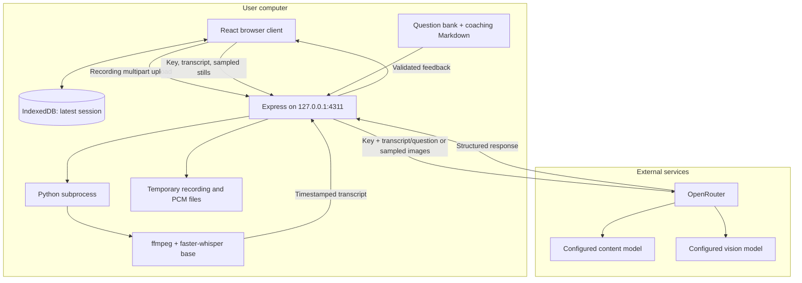
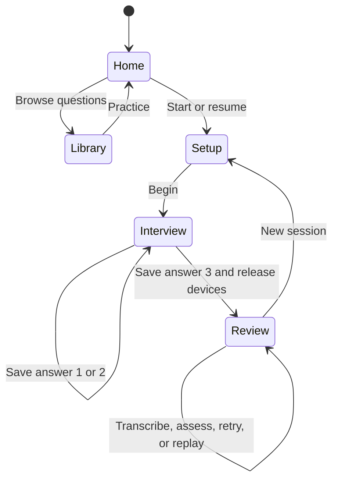
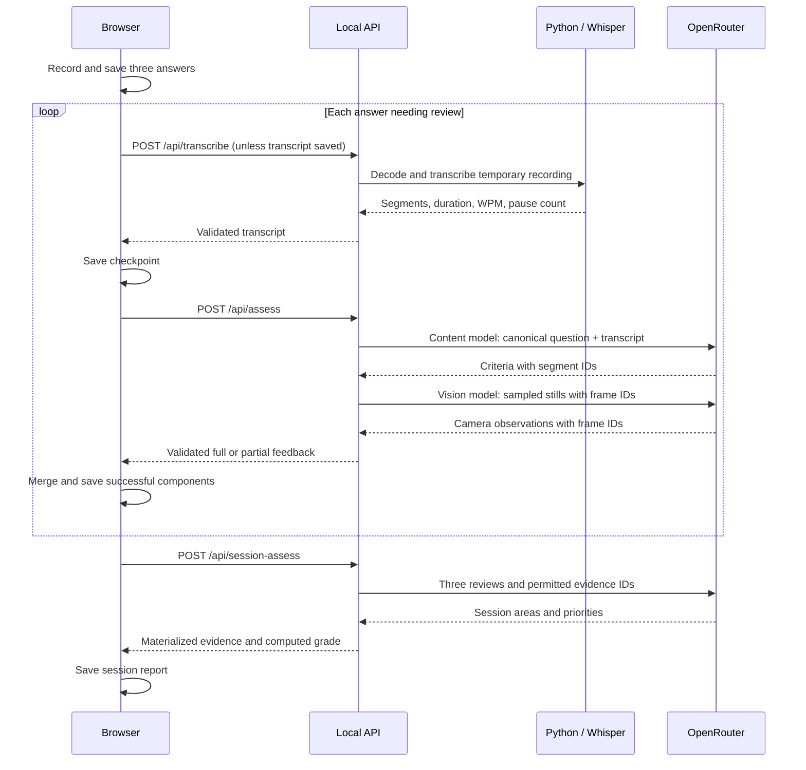

# Video Interview OSS architecture

This document describes the implementation in this repository. It is a local, single-user interview practice app: a React browser client, an Express service on loopback, a Python transcription subprocess, and external model calls through OpenRouter. There is no hosted account system, server-side session database, agent framework, or background job service.

## 1. Product contract

A session contains exactly three questions: motivation for commercial law, competency/experience, and a personal prompt. Reading is untimed. **Answer now** begins a five-second countdown, followed by at most 60 seconds of recording. The user can stop earlier. Feedback is shown after all three answers, not between questions.

`src/lib/timing.ts` owns timing constants. Resuming a legacy session does not restore older timing choices. The default draw excludes questions marked as requiring unavailable context; the searchable library retains all 201 entries.

Feedback concerns the answer and supported presentation observations. The system must not infer personality, emotion, honesty, identity, suitability, or hiring outcomes from a face or voice. Scores are coaching aids, not validated psychometric measurements.

## 2. Runtime and trust boundaries

Development uses Vite on `127.0.0.1:4310`, proxying `/api` to Express on 4311. In production mode Express serves `dist/` and the API together on 4311. That is a local production build; this service is not ready to be exposed to a public network.

The browser requests camera/microphone access only when starting setup. The server receives raw media for local transcription. OpenRouter receives the assessment key, textual inputs, and image data for the relevant calls, but no raw recording. Whisper model weights may download on first use. CSS also imports Google Fonts, so loading the UI may contact Google's font services.

## 3. Repository map

| Path | Responsibility |
|---|---|
| `src/App.tsx` | Screen state, setup, session orchestration, persistence, analysis/retry, settings and library. |
| `src/components/Recorder.tsx` | Preparation, countdown, MediaRecorder lifecycle, cap, still sampling, cleanup. |
| `src/components/SessionReview.tsx` | Session report, content areas, camera section, priorities and evidence navigation. |
| `src/components/AnswerReview.tsx` | Per-answer player, scores, observations, transcript evidence and download. |
| `src/lib/capture.ts` | Supported MIME selection and unmirrored JPEG frame extraction. |
| `src/lib/session.ts` | Client data types, IndexedDB adapter, time formatting and API response errors. |
| `src/lib/feedback.ts` | Completeness checks and preservation of successful components across retries. |
| `src/lib/timing.ts` | Fixed countdown and recording limits. |
| `src/lib/test-camera.ts` | Development-only generated video with an optional local synthetic audio fixture. |
| `src/data/questions.ts` | Client question bank, original source IDs, category/page mapping and draw eligibility. |
| `src/data/rubrics.ts` | Reference criteria; not an active additional grading pipeline. |
| `server/index.ts` | Loopback listener and HTTP timeouts. |
| `server/app.ts` | Host/origin checks, limits, routes, concurrency, production static files and safe errors. |
| `server/transcription.ts` | Dependency checks, serialized ASR queue, temporary files and subprocess execution. |
| `scripts/transcribe.py` | Audio decode, Whisper inference, segment mapping and pacing estimates. |
| `server/schema.ts` | Approved model constants, strict schemas, evidence materialization and score helpers. |
| `server/rubric.ts` | Canonical server question lookup and category-specific criteria. |
| `server/coaching.ts` | Load the shared coaching Markdown and expose its version. |
| `server/assessment.ts` | Independent content and image requests, provider errors and per-answer feedback. |
| `server/session-assessment.ts` | Validate and synthesize three completed answer reviews. |
| `Practice_Interview_Question_Bank.md` | Runtime server question source. Must ship with the server. |
| `docs/COACHING_RUBRIC.md` | Runtime prompt instructions. Must ship with the server. |
| `scripts/check-publish.mjs` | Check staged/tracked content before publication. |

## 4. Browser state and persistence

The five top-level screens are `home`, `setup`, `interview`, `review`, and `library`. Navigation is managed through React state rather than a URL router. The parent owns the MediaStream; recorder cleanup does not stop parent-owned tracks. Leaving practice or finishing question three releases them.

The `Session` object includes an ID, creation timestamp, three questions, answers, timing fields, and optional session feedback/error. Each `Answer` holds the question, recording Blob, measured duration, sampled frames, optional transcript and assessment, and an error message.

`saveSession` writes the complete object to the `sessions` object store under key `current` in IndexedDB database `rehearsal-local`. This legacy internal name remains for compatibility. Only one session is retained. There is no automatic cloud backup, cross-device sync, or historical progress database. Reloading loads the saved session, but does not restore the API key.

Storage errors remain visible. In-memory recordings may still be downloadable while the tab is open. A new session replaces the saved one; deleting it removes the browser record, not any manually downloaded copy or data already sent to a provider.

The development `?testCamera=1` mode uses separate `rehearsal-test` storage and generated canvas video. It expects an optional, ignored synthetic WAV in `src/lib/dev-assets/`; the public clone does not contain that file. The fixture is not imported into production bundles. Do not use normal user storage or a real camera for automated screenshots.

## 5. Recording and frame sampling

The browser asks for an ideal 1280×720 user-facing camera stream and microphone audio with echo cancellation/noise suppression. These are preferences; actual device settings can differ.

`capture.ts` selects a supported WebM or MP4 MIME type via `MediaRecorder.isTypeSupported`. The recorder collects chunks with a one-second timeslice and assembles a Blob on stop. Timer and device failures are surfaced rather than silently producing a successful answer.

The preview is mirrored through CSS. Captured frames use the original video pixels, so they remain unmirrored. Each frame is a JPEG with a maximum dimension of 640 pixels at quality 0.82, paired with elapsed recording time. The recorder samples about every two seconds at the current cap, includes the initial/final moments, and limits the array to 32 frames. It adapts the sampling interval for longer limits, though the product currently fixes answers at 60 seconds.

Before assessment, the client omits frames beyond the duration reported by decoded audio. This matters when browser time and container/audio duration differ. Visual feedback can locate a sampled moment; it cannot establish continuous movement or the onset/duration of a gesture.

## 6. End-to-end analysis

Answers are processed sequentially in the client after the third recording. Content and vision are independent requests with independent error handling; the current server executes the content request first, then vision. A content failure does not prevent an attempted camera review unless processing is cancelled.

### Local transcription

Availability checks import `faster_whisper` in a candidate interpreter and execute `ffmpeg -version`. Results are cached for 30 seconds. An explicit `TRANSCRIBE_PYTHON` overrides discovery. Otherwise the server tries the checkout's `.venv/bin/python`, `python3`, and a legacy user-level watch-skill interpreter if present. Nothing is installed automatically by the server.

A promise queue allows only one ASR subprocess at a time. The API admits at most three transcription requests, including queued work. Each recording is written with mode `0600` under an OS temporary directory. Python creates another temporary directory for PCM audio. Normal success and error paths clean both up; an abrupt OS/process termination can leave temporary artifacts.

ffmpeg decodes mono, 16 kHz, signed 16-bit PCM using local file/pipe protocols. It extracts at most 601 seconds so inputs exceeding the supported 600-second backend limit can be rejected. The UI's 60-second cap is stricter. Whisper uses the `base` model on CPU with int8, word timestamps, and voice activity filtering. The TIPS word-gap splitter produces review segments.

WPM equals transcribed word count divided by the entire recording duration, multiplied by 60. Pause count counts internal word gaps of at least 1.5 seconds. Neither is an estimate of confidence or fluency. Transcription and segment boundaries can be wrong; replay remains essential.

### Per-answer assessment

`server/schema.ts` configures:

| Role | Model identifier |
|---|---|
| Transcript content | `google/gemini-3.1-flash-lite` |
| Camera stills | `qwen/qwen3-vl-32b-instruct` |
| Whole-session synthesis | Same as transcript content |

These are implementation settings, not a guarantee of external availability. The legacy `model` request field accepts only the vision model; it does not let a browser select an arbitrary content model. The server chooses routing constants.

The server resolves the question ID from the Markdown bank. Submitted wording, category, and optional rubric cannot substitute their own instructions. Each content assessment uses three common criteria plus one category-specific criterion from `server/rubric.ts`. Both prompts load `docs/COACHING_RUBRIC.md`.

The content call receives canonical question data, transcript segments with stable IDs, and local pacing estimates. It receives neither audio nor images. The vision call receives ordered frames and frame IDs, not the transcript or raw recording. Both instruct the model to treat input content as evidence rather than instructions.

Requests use JSON schema output, temperature 0.2, a maximum output token budget of 8000, and `provider: { data_collection: 'deny', require_parameters: true }`. Content requests ask for low reasoning effort. Response healing is explicitly disabled. There is no application model fallback or LLM repair pass.

### Evidence and grades

Provider-selected segment IDs are mapped to the exact original segment text and start timestamp on the server. Frame IDs are mapped to their captured timestamps. The application does not accept model-invented replay timestamps or free-form quote text for these outputs.

Zod validates structure, limits and value types. Additional checks ensure transcript text agrees with ordered segments, questions exist, rubric criteria match exactly once, rated criteria contain evidence, and IDs exist in their supplied input. These checks establish source correspondence; they do not prove that a model's interpretation is correct or that a transcript is true.

Criterion scores are integers 0–10 or null when unassessable. Ratings are derived locally: 7+ is `strong`, 5–6 is `developing`, below 5 is `needs_work`; null is `not_assessable`. An answer score averages its numeric criteria to one decimal place.

### Session synthesis

The session endpoint requires exactly three completed content reviews. It validates their criteria/evidence against included transcripts where supplied. Legacy saved feedback without transcripts is accepted with an explicit limitation. Camera observations in saved reviews are client-supplied records, not cryptographically authenticated evidence.

The server builds a deduplicated evidence table and asks the content model for four areas: relevance, examples and reasoning, structure, and camera presentation. Each rated area must cite existing evidence IDs of the correct kind. The server restores source answer indices, text, and timestamps.

The overall score averages the three numeric content-area scores, excluding camera presentation. This is a new session synthesis, not simply the mean of the three per-answer scores. Missing camera evidence does not reduce the content grade. Session synthesis receives prior camera observations as text; it does not inspect new images or hear audio.

## 7. API surface and limits

| Route | Request | Result |
|---|---|---|
| `GET /api/health` | None | Local dependency readiness, model constants and rubric metadata. |
| `POST /api/transcribe` | One multipart file named `recording` | Transcript text, ordered segments, decoded duration, metrics and warnings. |
| `POST /api/assess` | Key, allowed model, question ID/details, transcript, up to 32 frames | Content/camera status, criterion feedback, observations, evidence, metrics and limitations. |
| `POST /api/session-assess` | Key and exactly three question/assessment records; optional underlying transcripts | Four areas, evidence links, priorities, computed content score and limitations. |

| Resource | Limit |
|---|---|
| Multipart upload | One file, 100 MiB; no extra form fields. |
| JSON body | 14 MB parser setting. |
| Frames | 32; at most 1,500,000 data-URL characters each and 12,000,000 combined. |
| Transcript | 50,000 text characters, 2,000 segments, at most 600 seconds. |
| Provider response | 200,000 bytes. |
| Admitted transcription requests | Three, with one ASR subprocess at a time. |
| Active assessment routes | Three shared slots across answer and session requests. |
| Python subprocess | 300 seconds, 2,000,000-byte output buffer. |
| ffmpeg decode | 45 seconds. |
| Provider attempt | 60 seconds; at most two attempts for HTTP 429/5xx. |
| HTTP server | 360-second request timeout; 15-second header timeout. |

The provider timeout is per attempt, not a fixed whole-session deadline. Health confirms installed executable/import availability, not downloaded weights, model quality, API credit, or future provider success.

## 8. Failures, retries and cancellation

A missing key opens Settings. The app never substitutes demo feedback for missing credentials or a provider failure. Safe API errors expose a code/message and sometimes an upstream status, while discarding raw provider bodies and avoiding logs that could contain keys or recordings.

A successful content or visual component can survive failure of the other. `mergeAssessment` retains prior successful components across retries. If neither component succeeds, the request fails. The client persists recordings, transcripts, and completed reviews between stages so a failed attempt can be resumed without re-recording or retranscribing already saved answers.

Automatic session synthesis runs when all answer reviews satisfy the client completeness check. A separate session retry uses existing answer feedback. Because the completeness check treats a visual failure as incomplete, automatic synthesis waits for that failure to be resolved even if content exists.

The client aborts active fetches on unmount or stopping review. Assessment routes propagate response disconnects to provider calls. Transcription is serialized but does not currently cancel its Python subprocess on a browser disconnect; cleanup still runs when the job finishes or times out. Restarting the service loses queues and in-flight jobs, not the browser's saved recordings.

## 9. Security and privacy model

The service binds to `127.0.0.1`. Host headers must name `localhost` or `127.0.0.1`; browser Origin headers, when present, must use local HTTP ports 4310, 4311, or 5173. No permissive CORS middleware is enabled. Responses have `Cache-Control: no-store`.

These are local-app protections, not user authentication. Non-browser local clients can call the API without an Origin header. A hostile process on the same computer, a compromised browser/extension, or someone with access to the browser profile is outside this isolation model. Do not expose the service through a public tunnel or bind it to all interfaces without designing authentication, TLS, quotas, storage isolation, consent, and retention controls.

The key exists in tab memory, request bodies to the local API, and the OpenRouter authorization header. It is not intentionally written to IndexedDB, disk, or logs. Browser developer tools and process memory can still observe it. The browser stores recordings and frames without application-level encryption.

Git publication is a separate boundary. `.gitignore` excludes media, secrets, source PDFs, QA artifacts and local state. `check-publish.mjs` checks the exact Git index, permits only named product screenshots as binary assets, and detects common credential formats. It cannot prove the absence of every secret or identify a person in a screenshot; human inspection and an independent secret scan remain part of release review. A leaked committed secret must be revoked, not merely deleted from the latest tree.

## 10. Configuration and local operation

| Setting | Behavior |
|---|---|
| `TRANSCRIBE_PYTHON` | Explicit Python executable containing faster-whisper; set in the launching shell. |
| `FFMPEG_PATH` | Explicit ffmpeg executable; otherwise `ffmpeg` on PATH. |
| `NODE_ENV=production` | Serve the built frontend from Express. Set by `npm start`. |
| OpenRouter key | Enter through Settings. No server-wide key variable. |
| Models | Constants in `server/schema.ts`; changes require validation of request/output compatibility. |
| Ports | Currently fixed by npm scripts, Vite proxy configuration and server entrypoint. |

Node 24 is the documented baseline. `npm start` still executes TypeScript with `tsx`; it is not a self-contained compiled backend. Keep Node dependencies, the Python environment, scripts, vendor code, the question Markdown, and coaching Markdown alongside `dist`. The static Vite bundle alone cannot transcribe or assess answers.

## 11. Tests and extension points

Run `npm test`, `npm run build`, and `npm run check:publish`. Tests cover question selection, recorder timing and lifecycle, frame capture, settings/key persistence boundaries, retries, schema/evidence validation, provider failures, request limits, and session synthesis. Provider responses in unit tests are controlled fixtures. Passing them does not establish live provider availability or coaching quality.

Manual acceptance should check camera permission, countdown, a full automatic 60-second stop, early stop, all three answers, replay seeking, reload/resume, deletion, and a real user-authorized provider review. Synthetic inputs can validate plumbing without publishing personal media. The documentation includes empty screens and an anonymized saved-session example. The replay face is heavily blurred; its image was edited and upscaled. Those screenshots illustrate behavior and are not a fresh provider validation or an assessment-quality benchmark.

For a different interview domain, update both question sources, default category selection, runtime rubric generation, prompt wording, and tests. Keep server lookup authoritative; client-only edits are insufficient. For timing changes, update `timing.ts`, UI copy, tests, and frame sampling expectations together. For another model, preserve structured validation and evidence IDs before testing live behavior.

Public hosting, multiple saved sessions, encrypted persistence, continuous-video analysis, audio prosody analysis, independently verified commercial facts, and calibrated hiring predictions are not implemented. Treat any work in these areas as new product and architecture decisions.
